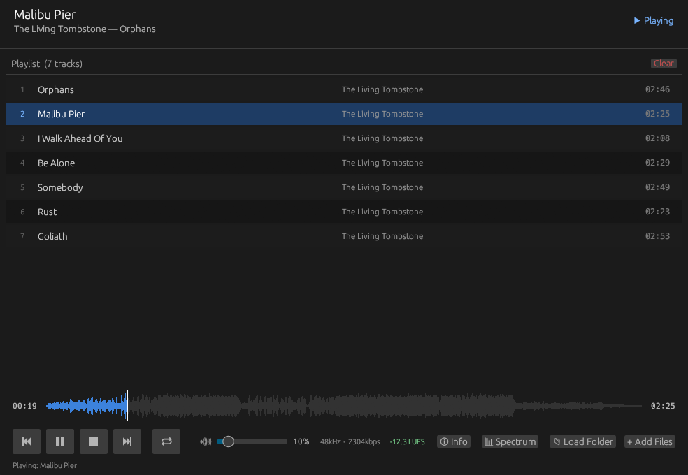
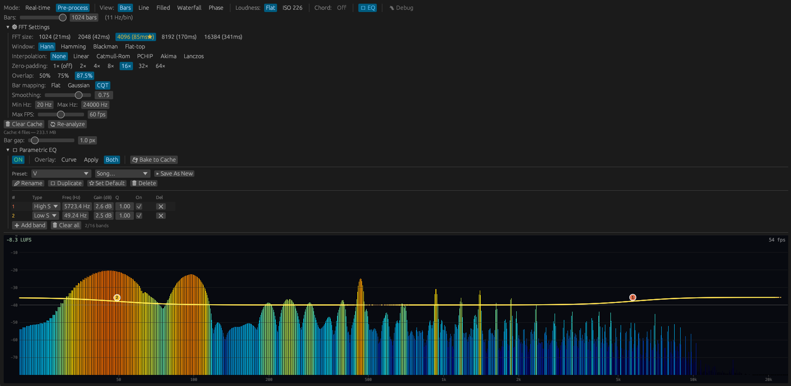

# Changelog

## [0.1.0] - 2026-04-04

Initial public release.

  

  

### Spectrum Analyzer
- Pre-processed + real-time hybrid mode: full-track FFT analysis runs in the background while real-time FFT feeds the display; display switches seamlessly between the two
- Seven visualization styles: Bars, Line, Filled Area, Waterfall, Spectrogram, Octave Bands, Phasescope
- CQT (Constant-Q Transform) bar mapping — equal relative frequency resolution per bar across the full spectrum
- Flat Overlap and Gaussian bar mapping modes also available
- FFT zero-padding up to 16× for sub-bin frequency resolution
- Six window functions: Hann, Hamming, Blackman, Flat Top, and more
- Overlap up to 87.5% for high temporal resolution
- Six sub-bin interpolation modes: None, Linear, Catmull-Rom, PCHIP, Akima, Lanczos
- Auto FFT size scaling: adapts to the track's sample rate to maintain a consistent ~85ms analysis window
- Analysis caching: pre-processed frames cached to disk; switching settings reloads from cache instantly; "needs re-analyze" banner shown when cache is unavailable for current settings
- Cache size and file count display in settings panel
- Flat and ISO 226:2003 equal-loudness weighting (40 phon)
- Configurable frequency range, bar count, smoothing, bar gap

### Parametric EQ
- Up to 16 bands per track
- Band types: Peaking, Low Shelf, High Shelf, High Pass, Low Pass, Notch
- Biquad IIR filters using Audio EQ Cookbook formulas, applied in real time via a rodio Source wrapper
- Draggable nodes directly on the spectrum: click empty space to add a band at that frequency/gain, drag to adjust, right-click to remove
- EQ overlay modes: Curve (response curve drawn over bars), Apply (bar heights reflect EQ gain), Both
- Bake to cache: re-analyze the current track with EQ applied and store the result

### EQ Presets
- Global presets (available for all tracks) and song-specific presets (per file path)
- Auto-load on track change: loads last-used preset for that track; falls back to default global preset; falls back to empty
- Modified indicator: preset name shows `*` when live bands differ from the saved state
- Update and Discard buttons when a preset has been modified
- Pending-switch prompt when switching presets with unsaved changes: Save & switch / Discard & switch / Cancel
- Save As New with name input and scope selector (Global / Song)
- Rename preset inline
- Duplicate preset
- Delete preset with inline confirmation
- Set as Default (★) for global presets — used as the fallback for tracks with no last-used preference
- Presets persisted as JSON at `~/.moosik/eq_presets.json`

### Player
- Audio playback via rodio + symphonia (MP3, FLAC, OGG, WAV, AAC, and more)
- Waveform seek bar with click-to-seek and live position display
- Volume control
- Track metadata: title, artist, album, duration via lofty
- Album cover art display
- CJK font fallback (Japanese, Chinese, Korean tags display correctly on all platforms)
- Momentary LUFS display
- Stereo correlation meter
- Chord detection and timeline overlay
