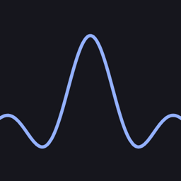

# Moosik

<p align="center">
  
</p>

A desktop music player with bit-perfect output, a professional-grade spectrum analyzer, and a parametric EQ, built in Rust.

### The icon

The waveform is a [sinc function](https://en.wikipedia.org/wiki/Sinc_function) — the mathematical foundation of sampling theory and the ideal low-pass filter. The axes are scaled at **8.539:1** (≈ πe), cropped at x = ±8.539 and centered vertically at y = 0.444 ± 1 (1.444 ≈ e^(1/e), the maximum of x^(1/x)).

The background is **Eigengrau** (#16161d) — the color the human brain perceives in total darkness.

The waveform is **Kugelblitz** (#94b1ff) — the theoretical RGB of an infinite-temperature blackbody radiator, which emits all frequencies equally. A perfectly flat spectrum. The EQ ideal.

<p align="center">
  
</p>

<p align="center">
  
</p>

## Features

### Bit-Perfect Output
- **Native-rate, bit-transparent playback** — toggle the 💎 button and audio is sent to the device at the file's exact sample rate, decoded at full precision (24-bit safe) and converted to the device's native format with exact power-of-two scaling, so integer sources reach the DAC unchanged
- **Windows: WASAPI exclusive mode** — opens the device exclusively, like foobar2000's WASAPI output, bypassing the Windows mixer; a DAC pinned to e.g. 384 kHz in the control panel still plays 44.1/48/96/192 kHz tracks at their native rate
- **Linux / macOS** — direct cpal output at the exact rate; choosing an ALSA `hw:` device skips the PipeWire/Pulse resampling shims
- **Device picker** — the 🔈▾ menu lists every output device with its real capabilities (supported rates, sample formats, channels), probed in the background; pick one or stay on the system default. Your choice is remembered
- **Honest fallbacks** — if a device can't play a track's format, playback drops to normal mode with a message listing what the device *does* support; EQ is bypassed in this mode (and the EQ panel says so), and the 💎 tooltip warns when volume is below 100%, since attenuation breaks bit-perfectness

### Spectrum Analyzer
- **Pre-processed + real-time hybrid** — full-track analysis runs in the background while real-time FFT feeds the display during playback; seamlessly switches between the two
- **Multiple visualization styles** — Bars, Line, Filled Area, Waterfall, Spectrogram, Octave Bands, Phasescope
- **Peak Hold** — configurable marker that tracks the highest level per bar; three decay modes (Linear, Gravity, Fade Out), hold time, fall speed, thickness, and color all adjustable
- **CQT bar mapping** — Constant-Q Transform mapping gives each bar the same relative frequency resolution regardless of pitch, just like professional analyzers
- **Configurable FFT** — up to 16× zero-padding, six window functions (Hann, Hamming, Blackman, Flat Top), up to 87.5% overlap
- **Six interpolation modes** — None, Linear, Catmull-Rom, PCHIP, Akima, Lanczos
- **Auto FFT size scaling** — adapts to the track's sample rate to maintain a consistent analysis window
- **Analysis caching** — pre-processed frames cached to disk; settings buttons highlight green when a cache exists for that combination; "Clear All" button; reanalysis warning fires on any cache-key change
- **Loudness** — flat or ISO 226:2003 equal-loudness weighting

### Parametric EQ
- **Up to 16 bands** — Peaking, Low Shelf, High Shelf, High Pass, Low Pass, Notch
- **Biquad IIR filters** (Audio EQ Cookbook) — applied in real time via a `rodio` Source wrapper
- **Draggable nodes on the spectrum** — click to add a band, drag horizontally for frequency, drag vertically for gain, right-click to remove
- **EQ overlay modes** — Curve (response curve drawn over spectrum), Apply (bar heights reflect EQ gain), Both
- **Bake to cache** — re-analyze the track with EQ applied and cache the result

### EQ Presets
- **Global and song-specific presets** — two separate dropdowns, one active at a time
- **Auto-load on track change** — loads the last-used preset for the track, falls back to the default global preset, then empty
- **Modified indicator** — preset name shows `*` when bands have been changed; Update and Discard buttons appear
- **Pending-switch prompt** — switching presets while modified asks Save & switch / Discard & switch / Cancel
- **Full preset management** — Save As New, Rename, Duplicate, Delete (with confirmation), Set as Default (★)
- **Persistent** — stored as JSON in `~/.moosik/eq_presets.json`

### Album Art
- **Playlist thumbnails** — 28×28 cover art thumbnail in every playlist row; hover for 1 second to see a 512px preview
- **Transparent overlay** — art rendered behind the spectrum at adjustable opacity; Contain / Cover / Stretch fit modes
- **Mask mode** — spectrum bars act as a cut-out window into the art, each bar textured with the art region it covers; brightness can track bar magnitude dynamically or be fixed
- **Art Settings panel** — collapsible section in the spectrum window; global settings with optional per-track overrides
- **Spectrum placeholder** — configurable ♪ glyph when a track has no embedded art
- **Persistent** — settings stored in `~/.moosik/art_settings.json`

### Player
- **Gapless playback** — consecutive tracks play with no silence between them, in both normal and bit-perfect mode (bit-perfect stays gapless across same-rate tracks; a sample-rate change re-opens the device)
- Waveform seek bar with click-to-seek
- Volume control
- Metadata display (title, artist, album, cover art) via `lofty`
- CJK font fallback (Japanese, Chinese, Korean tags display correctly)
- **OS media integration** — hardware media keys and the system now-playing panel (MPRIS on Linux, SMTC on Windows, Now Playing on macOS): play/pause/next/previous/stop, live title/artist/album and playback position
- **ReplayGain** — loudness normalization (Track / Album), reading ReplayGain tags when present and falling back to Moosik's own measured LUFS for untagged files; clip-prevention toggle; bypassed in bit-perfect mode
- Momentary LUFS display
- Stereo correlation meter

## Building

Requires Rust (stable, edition 2024).

On Linux, the audio backend (cpal/ALSA) needs the ALSA development headers:

```sh
sudo apt install libasound2-dev   # Debian/Ubuntu
```

Then:

```sh
git clone https://github.com/HenloAmHorse/Moosik
cd Moosik
cargo build --release
./target/release/moosik
```

### Dependencies

All pulled automatically via Cargo:

| Crate | Purpose |
|---|---|
| `eframe` / `egui` | Immediate-mode GUI |
| `rodio` | Audio playback (normal mode) |
| `cpal` | Direct device output (bit-perfect mode, Linux/macOS) |
| `wasapi` | WASAPI exclusive-mode output (bit-perfect mode, Windows) |
| `symphonia` | Audio decoding (MP3, FLAC, OGG, WAV, AAC, …) |
| `rtrb` | Lock-free ring buffer (decode → output) |
| `rustfft` | FFT engine |
| `rayon` | Parallel analysis |
| `lofty` | Tag / metadata reading |
| `souvlaki` | OS media-key / now-playing integration (MPRIS / SMTC / macOS) |
| `image` | Album art decoding |
| `serde` / `serde_json` | Preset / settings persistence |

## Platform Support

| Platform | Status | Bit-perfect backend |
|---|---|---|
| Linux | Tested | cpal — direct ALSA `hw:` device for true bit-perfect |
| Windows | Tested | WASAPI exclusive mode |
| macOS | Should work | cpal — direct CoreAudio output |

## License

GNU Affero General Public License v3.0 — see [LICENSE](LICENSE).
