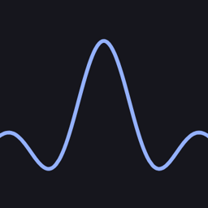
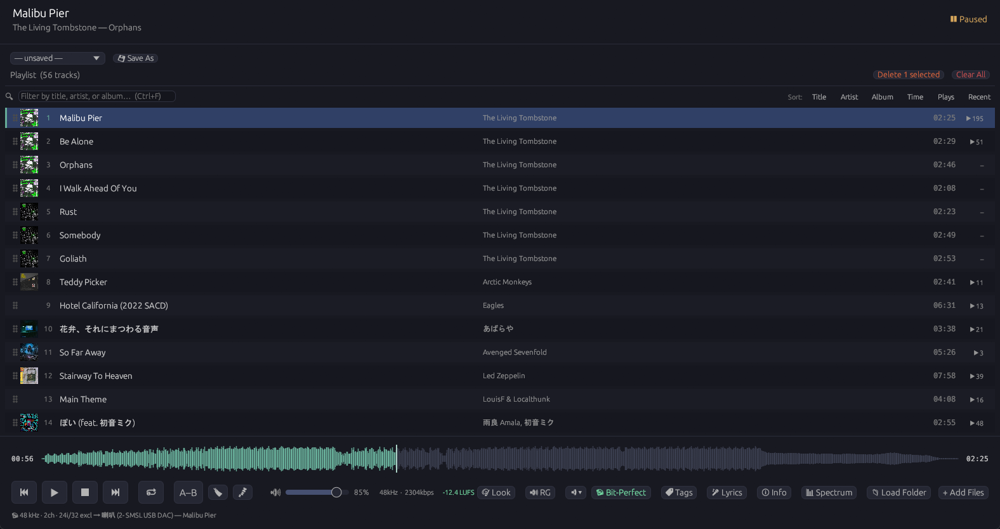
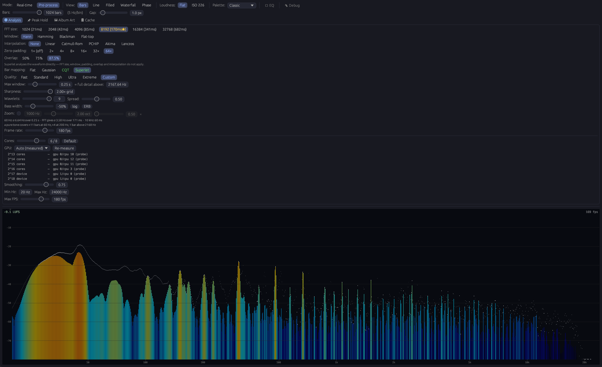

# Moosik

<p align="center">
  
</p>

A desktop music player with bit-perfect output (PCM and DSD), a professional-grade spectrum analyzer, and a parametric EQ, built in Rust.

### The icon

The waveform is a [sinc function](https://en.wikipedia.org/wiki/Sinc_function) — the mathematical foundation of sampling theory and the ideal low-pass filter. The axes are scaled at **8.539:1** (≈ πe), cropped at x = ±8.539 and centered vertically at y = 0.444 ± 1 (1.444 ≈ e^(1/e), the maximum of x^(1/x)).

The background is **Eigengrau** (#16161d) — the color the human brain perceives in total darkness.

The waveform is **Kugelblitz** (#94b1ff) — the theoretical RGB of an infinite-temperature blackbody radiator, which emits all frequencies equally. A perfectly flat spectrum. The EQ ideal.

<p align="center">
  
</p>

<p align="center">
  
</p>

## Features

### Bit-Perfect Output
- **Native-rate, bit-transparent playback** — toggle the 💎 button and audio is sent to the device at the file's exact sample rate, decoded at full precision (24-bit safe) and converted to the device's native format with exact power-of-two scaling, so integer sources reach the DAC unchanged
- **Windows: WASAPI exclusive mode** — opens the device exclusively, like foobar2000's WASAPI output, bypassing the Windows mixer; a DAC pinned to e.g. 384 kHz in the control panel still plays 44.1/48/96/192 kHz tracks at their native rate
- **Linux / macOS** — direct cpal output at the exact rate; choosing an ALSA `hw:` device skips the PipeWire/Pulse resampling shims
- **Device picker** — the 🔈▾ menu lists every output device with its real capabilities (supported rates, sample formats, channels), probed in the background; pick one or stay on the system default. Your choice is remembered
- **Honest fallbacks** — if a device can't play a track's format, playback drops to normal mode with a message listing what the device *does* support; EQ is bypassed in this mode (and the EQ panel says so), and the 💎 tooltip warns when volume is below 100%, since attenuation breaks bit-perfectness

### DSD Playback
- **DSF & DSDIFF** — `.dsf`/`.dff` files are first-class: header-parsed stream
  properties, ID3v2 tags (title/artist/album, ReplayGain, embedded cover art)
  through the same pipeline as every other format
- **Bit-perfect DoP** — DSD64/128/256 play as DSD-over-PCM (DoP 1.1): the raw
  1-bit stream packed untouched into 24-bit words at the carrier rate
  (176.4/352.8/705.6 kHz), integer-only device formats, volume/EQ/ReplayGain
  hard-bypassed. The status line shows the exact mode, e.g.
  *💎 DSD128 via DoP · 352.8 kHz · 2ch · 24i excl*
- **Gapless DSD** — same-rate DSD tracks hand off with no device re-open and
  an unbroken DoP marker sequence; sessions lead in and out with DSD-marked
  silence so the DAC locks (and unlocks) cleanly
- **Automatic PCM fallback** — if the device can't take the DoP carrier rate,
  the bitstream is decimated to high-rate PCM and played through the normal
  path instead (volume/EQ/ReplayGain apply), with a clear status notice —
  DSD files are never simply unplayable
- **Analyzer support** — spectrum, waveform, LUFS/DR and spectral ceiling run
  on a decimated PCM feed (176.4 kHz default, 352.8 kHz selectable for a
  faster-reacting spectrum); playback stays raw bits over DoP
- **Native DSD** (experimental, on by default — build with
  `--no-default-features` to exclude it) — pick a native output in the 🔈
  menu and DSD plays as raw native DSD with no DoP carrier ceiling,
  unlocking **bit-perfect DSD512** — and likely **DSD1024** too: the rate
  is negotiated with the driver directly rather than picked from a fixed
  list, so nothing in the code stops at 512 (not hardware-verified at 1024
  yet). Falls back to DoP, then decimated PCM, automatically.
  - **Windows (x86_64): ASIO** — pick your DAC's ASIO driver under
    "Native DSD (ASIO)". No Steinberg SDK required. Hardware-verified on
    an SMSL C200Pro.
  - **Linux: ALSA** — pick your DAC's direct `hw:` device under
    "Native DSD (ALSA)"; playback uses the kernel's native DSD formats
    (`DSD_U32_BE`/`U16`/`U8`), the same route MPD uses. The card's driver
    must advertise DSD formats, and the device must be free — PipeWire /
    PulseAudio hold `hw:` devices, so reserve or release the card first.
    Not yet hardware-verified (the transport is exercised end-to-end in
    tests; a real DAC report would be very welcome).
  - Driver behavior varies by vendor on both platforms, so a new DAC may
    surface new quirks the first time it's tried — if yours does, the
    console log (run from a terminal) shows each negotiation step
  - macOS has no native-DSD transport (CoreAudio is DoP-only), so DSD
    plays via DoP there

### Spectrum Analyzer
- **Pre-processed + real-time hybrid** — full-track analysis runs in the background while real-time FFT feeds the display during playback; seamlessly switches between the two
- **Multiple visualization styles** — Bars, Line, Filled Area, Waterfall, Spectrogram, Octave Bands, Phasescope
- **Selectable palette** — seven colour ramps (Classic, Kugelblitz, Ice, Magma, Aurora, Mono, and an Album-accent ramp that follows the cover art), picked from the control row with a gradient swatch preview and applied across bars, octave bands, line, filled, spectrogram, and waterfall
- **Settings persist** — the view settings (style, bars, window, interpolation, padding, overlap, bar mapping, frequency range, …) restore across launches (`~/.moosik/spectrum.json`)
- **Peak Hold** — configurable marker that tracks the highest level per bar; three decay modes (Linear, Gravity, Fade Out), hold time, fall speed, thickness, and color all adjustable
- **CQT bar mapping** — Constant-Q Transform mapping gives each bar the same relative frequency resolution regardless of pitch, just like professional analyzers
- **Adaptive Superlet Transform** — an alternative to the FFT that analyses the waveform directly with sets of Morlet wavelets, taking the geometric mean of their responses. Where an FFT uses one window width for the whole spectrum, this varies it per frequency, which is what a log-spaced bar grid actually wants. Pre-process only; the live view keeps using the FFT. Five quality presets plus a Custom mode exposing the window budget, sharpness, wavelet count and spread, with a live readout comparing each against the FFT
  - *Bass*: resolves detail no FFT setting reaches — at 60 Hz it separates tones 1.5 Hz apart that a 171 ms FFT window renders as a single blob. The cost is honest and unavoidable: constant-Q at the bottom of hearing needs windows measured in seconds, so bass responds more slowly. The window budget is a slider, not a hidden curve
  - *Treble*: strictly better, for free — 24 ms of temporal smearing at 10 kHz against the FFT's 171 ms, with no loss of frequency detail the display can show
  - *Around 500 Hz – 2 kHz*: roughly a wash. An FFT is genuinely good there, and nothing pretends otherwise
  - Analysis runs 1–17 minutes per five-minute track depending on preset, with a live ETA, a progress bar and an Abort button. Long wavelets are convolved in the frequency domain, which is 4–5× faster and numerically identical (measured worst-case difference 2×10⁻⁷)
- **Configurable FFT** — up to 16× zero-padding, six window functions (Hann, Hamming, Blackman, Flat Top), up to 87.5% overlap
- **Six interpolation modes** — None, Linear, Catmull-Rom, PCHIP, Akima, Lanczos
- **Auto FFT size scaling** — adapts to the track's sample rate to maintain a consistent analysis window
- **Refresh-rate-aware frame cap** — Max FPS defaults to the monitor's refresh rate (up to 240) so the animation is as smooth as the display allows, adjustable in the settings
- **Analysis caching** — pre-processed frames cached to disk; settings buttons highlight green when a cache exists for that combination; "Clear All" button; reanalysis warning fires on any cache-key change. A size budget (4 GB by default) evicts least-recently-used caches after each analysis, since a superlet track at 180 fps costs 45–80 MB and cannot be packed much smaller — the low byte of every stored value is quantisation noise, so no lossless coder beats about 12 %
- **GPU acceleration** — the superlet pre-process offloads its large convolutions to the GPU through wgpu (Vulkan or Metal, so AMD, Intel, NVIDIA and Apple are all covered). Measured against the same build with the device off: High 1.23×, Ultra 1.71×, Extreme 1.32×. Fast and Standard are unchanged by design — their kernels never reach a size where a device beats the cores
  - *Calibrated per machine, not assumed.* The crossover between GPU and CPU is a property of one device against one core count, so it is measured rather than hardcoded: a probe on first run picks a starting point, then real analyses A/B the two routes and settle it on evidence. A device that turns out slower gets switched off by itself. Settings expose Auto / Always / Off, a Re-measure button, and the per-size table
  - *Analysis core budget* — a slider, defaulting to two fewer threads than the machine has, so the output thread keeps its deadline while a track is being analysed
- **Bar spacing** — where the bars land, independent of how many there are
  - *Bass width*, a slider from wider-than-log through **log** (the classic analyser axis) to **ERB** (constant bars per auditory filter, Glasberg & Moore 1990). Not a resolution control: a tone's blur in bars and a bassline's travel in bars both scale with bar density, so the ratio is constant across the slider — what changes is how much screen the bass gets to move across. Below a capped window it costs nothing
  - *Zoom*, a lens anywhere on the axis with adjustable centre, width and strength. Bars are taken from the rest of the spectrum, never invented. Unlike bass width this is not free above ~1 kHz, so the panel quotes the cost multiplier
  - Every setting is the normalised integral of a strictly positive density, so the axis cannot fold back on itself or push a bar off the display at any setting
- **Loudness** — flat or ISO 226:2003 equal-loudness weighting, applied at display time so toggling it is instant

### Parametric EQ
- **Up to 16 bands** — Peaking, Low Shelf, High Shelf, High Pass, Low Pass, Notch
- **Biquad IIR filters** (Audio EQ Cookbook) — applied in real time via a `rodio` Source wrapper
- **Draggable nodes on the spectrum** — click to add a band, drag horizontally for frequency, drag vertically for gain, right-click to remove
- **EQ overlay modes** — Curve (response curve drawn over spectrum), Apply (bar heights reflect EQ gain), Both
- **Bake to cache** — re-analyze the track with EQ applied and cache the result

### EQ Presets
- **Global and song-specific presets** — two separate dropdowns, one active at a time
- **Auto-load on track change** — loads the last-used preset for the track, falls back to the default global preset, then empty
- **Modified indicator** — preset name shows `*` when bands have been changed; Update and Discard buttons appear
- **Pending-switch prompt** — switching presets while modified asks Save & switch / Discard & switch / Cancel
- **Full preset management** — Save As New, Rename, Duplicate, Delete (with confirmation), Set as Default (★)
- **Persistent** — stored as JSON in `~/.moosik/eq_presets.json`

### Album Art
- **Playlist thumbnails** — 28×28 cover art thumbnail in every playlist row; hover for 1 second to see a 512px preview
- **Transparent overlay** — art rendered behind the spectrum at adjustable opacity; Contain / Cover / Stretch fit modes
- **Mask mode** — spectrum bars act as a cut-out window into the art, each bar textured with the art region it covers; brightness can track bar magnitude dynamically or be fixed
- **Art Settings panel** — collapsible section in the spectrum window; global settings with optional per-track overrides
- **Spectrum placeholder** — configurable ♪ glyph when a track has no embedded art
- **Persistent** — settings stored in `~/.moosik/art_settings.json`

### Lyrics
- **🎤 Lyrics window** — its own window, so it can live on a second screen. The current line highlights and centres itself, sung lines dim, and a slider sets the text size
- **Reads `.lrc` beside the track, or the file's own tags** (`USLT` / Vorbis `LYRICS` / iTunes atom)
- **Online lookup via [LRCLIB](https://lrclib.net), then NetEase Cloud Music** — no account, no API key, and both serve *synced* lyrics, not just plain text. Two sources because one wasn't enough: on a real set of thirteen failing tracks LRCLIB returned zero hits for nine, since a Japanese/Vocaloid library is largely absent from it. NetEase had synced lyrics for nearly all of them
- **A source that can't answer never reports "no lyrics"** — a rate limit or an outage says nothing about whether the lyrics exist, so it's reported as such rather than sending you off to transcribe by hand
- **Matching built for messy tags** — the lookup is a ladder (exact → without album → structured search on normalised fields → normalised title), filtering and ranking on duration throughout. Normalisation folds full-width Latin, strips bracketed decoration (`【初音ミク】…【オリジナルMV】`), cuts at `feat.`, and keeps only the first artist credit. This is what finds a track whose artist field holds the producer where the database has the vocalist
- **Manual search** — type anything, see the hits with synced-vs-plain marked, pick one
- **Tap-along sync editor** — play the song and press Space as each line starts; a plain sheet becomes a timed one in a few minutes. Re-times existing sheets too, and resumes at the first untimed line
- **Sidecar-only writes** — lyrics are saved as `.lrc`; the audio file is never modified, which also makes this safe for DSD

### Tag Editing
- **🏷 Tags window** — edit title, artist, album, album artist, track/disc numbers, year, genre, composer and comment
- **Full tag viewer** — every key the file carries, including ones the editor doesn't touch (which are preserved on save)
- **Safe writes** — the change goes to a copy which then replaces the original by rename, so an interrupted write can't damage the file; the result is read back and verified before it's accepted
- **DSD is read-only** — DSF keeps its ID3 blob behind a header pointer, and a bad write there costs the audio, not the metadata

### Theme & Appearance
- **Cohesive theme, light or dark** — built from the app's own identity colors (the **Eigengrau** #16161d base and **Kugelblitz** #94b1ff accent): a tinted surface ramp, rounded corners, and accent-coloured selection and hover, applied across both the egui widgets and the custom-painted surfaces (seek bar, playlist rows, status text). A light variant is a click away
- **Per-track accent** — the now-playing bar, current-row marker, and seek fill take on an accent sampled from the current track's cover art (blended toward the brand blue so it never clashes); art-less or grayscale covers fall back to the brand accent
- **🎨 Look menu** — optional, persisted appearance controls (`~/.moosik/appearance.json`), all defaulting to the shipped look:
  - **Theme** — dark (default) or light
  - **Font** — pick any font installed on the system. Families are read from each file's own name table, so the list reads *Fira Code Medium* rather than `FiraCode-Medium`, and every face in a `.ttc` collection is offered; a filter box keeps a few hundred families navigable. CJK fallbacks stay installed behind whatever you pick, so a Latin-only font won't tofu your Japanese tags
  - **Text size** — a 70–160% UI-scale slider (applied on click), scaling all text and chrome
  - **Accent source** — album-art accent or the fixed brand accent

### Player
- **Gapless playback** — consecutive tracks play with no silence between them, in both normal and bit-perfect mode (bit-perfect stays gapless across same-rate tracks; a sample-rate change re-opens the device)
- **Playlist search** — a 🔍 box filters the playlist by title, artist, or album as you type (`Ctrl+F` to focus, `Esc` to clear)
- **Column sorting** — sort by Title / Artist / Album / Time, plus **Plays** and **Recent** from play history; click a column to sort, click again to reverse
- **Sleep timer** — stop after 15–90 minutes or at the end of the current track
- **A-B repeat** — loop a section of the current track, with markers on the seek bar
- **Bookmarks** — save and jump back to positions per track
- **Play statistics** — per-track play count and last-played, shown in the Info window and (optionally) as a column in the playlist
- Waveform seek bar with click-to-seek
- Volume control (volume and loop mode persist across launches)
- Metadata display (title, artist, album, cover art) via `lofty`
- CJK font fallback (Japanese, Chinese, Korean tags display correctly)
- **OS media integration** — hardware media keys and the system now-playing panel (MPRIS on Linux, SMTC on Windows, Now Playing on macOS): play/pause/next/previous/stop, live title/artist/album and playback position
- **ReplayGain** — loudness normalization (Track / Album), reading ReplayGain tags when present and falling back to Moosik's own measured LUFS for untagged files; clip-prevention toggle; bypassed in bit-perfect mode
- Momentary LUFS display
- Stereo correlation meter
- **Session log** — every run writes a timestamped file to `~/.moosik/logs/` (last ten kept), recording the machine, the output device and format actually negotiated, analysis timings, and a full backtrace on any panic. The **🗎 Log** button opens the folder. If something goes wrong, attach it to the bug report

## Building

Requires Rust (stable, edition 2024).

On Linux, the audio backend (cpal/ALSA) needs the ALSA development headers:

```sh
sudo apt install libasound2-dev   # Debian/Ubuntu
```

Then:

```sh
git clone https://github.com/HenloAmHorse/Moosik
cd Moosik
cargo build --release
./target/release/moosik
```

### Dependencies

All pulled automatically via Cargo:

| Crate | Purpose |
|---|---|
| `eframe` / `egui` | Immediate-mode GUI |
| `rodio` | Audio playback (normal mode) |
| `cpal` | Direct device output (bit-perfect mode, Linux/macOS) |
| `wasapi` | WASAPI exclusive-mode output (bit-perfect mode, Windows) |
| `symphonia` | Audio decoding (MP3, FLAC, OGG, WAV, AAC, …) |
| `rtrb` | Lock-free ring buffer (decode → output) |
| `rustfft` | FFT engine |
| `wgpu` / `pollster` / `bytemuck` | GPU compute for the superlet pre-process |
| `rayon` | Parallel analysis |
| `lofty` | Tag / metadata reading |
| `souvlaki` | OS media-key / now-playing integration (MPRIS / SMTC / macOS) |
| `image` | Album art decoding |
| `serde` / `serde_json` | Preset / settings persistence |

## Platform Support

| Platform | Status | Bit-perfect backend |
|---|---|---|
| Linux | Tested | cpal — direct ALSA `hw:` device for true bit-perfect |
| Windows | Tested | WASAPI exclusive mode |
| macOS | Should work | cpal — direct CoreAudio output |

## License

GNU Affero General Public License v3.0 — see [LICENSE](LICENSE).
